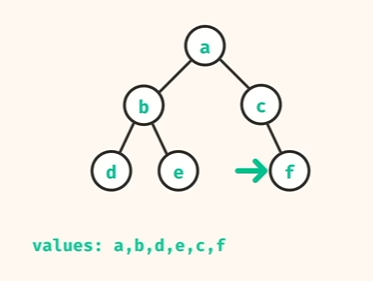

# Trees

1. Trees have nodes and links
2. They have a familial relationship - parent has child and child has parent
3. Root has no parent
4. Leaf node has no children

## Binary Tree

1. All nodes have at most two children
2. Exactly one path between a node and a root

A -> B is still a binary tree
A -> is also a binary tree

node -> [node.left -- node.right]

## Algorithms

### Depth First Traversal

Go all the way deep first, then go horizontal.


It uses a data structure like a stack

Stack - sequential data structure
Can add and remove items just from the top.

We maintain a stack that tracks the next node to be checked for children.
It is important to push the second child first because -

```
     A
    / \
   B   C
```

Here if we pushed B first and then C into the stack, while reading the value from the top, we will pick up C(the right node) instead of B(the left node). And the output would not be an ideal DFS on a binary tree

_Time Complexity_ - **O(n)** - It only goes through all the nodes once

_Space Complexity_ - **O(n)** - The stacks add only a count of total nodes at max

For the recursive method, we need to identify the smallest repeatable problem, and if the function is made to work for that subproblem, how to combine these sub-trees

Working with recursion is a test of trust in your code block. One does not need to keep a track of each call in the stack of recursion - rather make sure your base problem is solved by the function and "trust" that it will combine correctly.
Most of the time, you will handle the base case assuming that the function as a whole already does the correct job.

### Breadth First Traversal

This is a "queue" behavior
When reading a tree left to right, whatever is read first gets added to the values first (FIFO = queue).

_Time Complexity_ - **O(n)** - It only goes through all the nodes once

_Space Complexity_ - **O(n)** - The queue adds only a count of total nodes at max

### Tree Includes

Does the tree have a particular value or not?
Just perform any traversal - DFS or BFS

Recursive is also an option and is pretty elegant.

### Tree Sum

Can be implemented very easily with a traversal method, but the recursive method is very elegant and easy to implement, and also helps create a good understanding of the basics of recursion

### Tree Min

This is a fun problem because the recursive understanding at this point becomes kinda straight forward, but there is an "infinite catch."

### Max Root To Leaf Path Sum

Very interesting problem - think of this as any other tree recursion, but only retaining the largest node.
Also, something important is that we need to only work with leaf nodes, not the nulls beyond them, so we would need an additional check

## Problems

1. Invert Binary Tree - https://neetcode.io/problems/invert-a-binary-tree/question?list=neetcode150
2. Maximum Depth of Binary Tree - https://neetcode.io/problems/depth-of-binary-tree/question?list=neetcode150
3. Diameter of Binary Tree - https://neetcode.io/problems/binary-tree-diameter/question
4. Balanced Binary Tree - https://neetcode.io/problems/balanced-binary-tree/history?list=neetcode150&submissionIndex=0
5. Same Binary Tree - https://neetcode.io/problems/same-binary-tree/history?submissionIndex=3
6. Subtree of Another Tree - https://neetcode.io/problems/subtree-of-a-binary-tree/question?list=neetcode150
7. Lowest Common Ancestor in Binary Search Tree - https://neetcode.io/problems/lowest-common-ancestor-in-binary-search-tree/question
8. Binary Tree Level Order Traversal - https://neetcode.io/problems/level-order-traversal-of-binary-tree/history?submissionIndex=0
9. Binary Tree Right Side View - https://neetcode.io/problems/binary-tree-right-side-view/question?list=neetcode150
10. Count Good Nodes in Binary Tree - https://neetcode.io/problems/count-good-nodes-in-binary-tree/question?list=neetcode150
11. Valid Binary Search Tree - https://neetcode.io/problems/valid-binary-search-tree/history?submissionIndex=7
